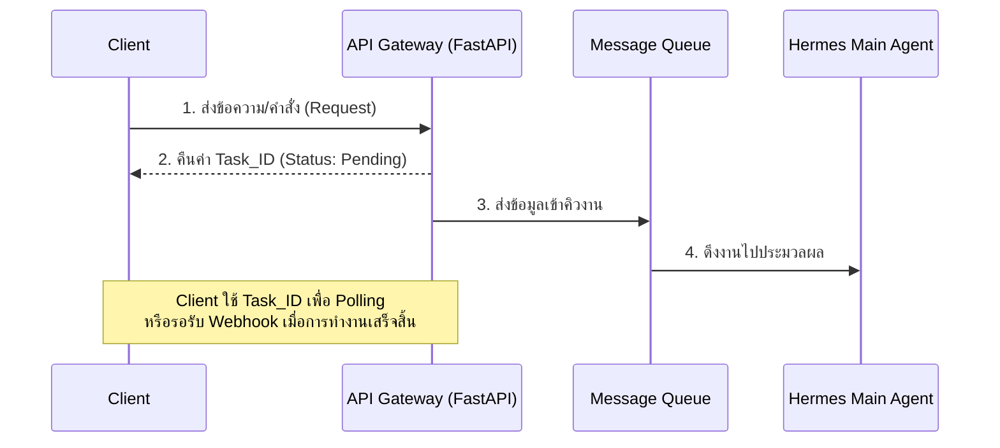

# เอกสารข้อกำหนดความต้องการซอฟต์แวร์ (Software Requirements Specification - SRS)
**โครงการ:** ระบบแปลภาษาและจัดการเนื้อหาอัตโนมัติ (HermesTranslate)
**วันที่:** 30 มิถุนายน 2026
**เวอร์ชัน:** 1.0

---

## 1. บทนำ (Introduction)

### 1.1 วัตถุประสงค์ (Purpose)
เอกสารฉบับนี้จัดทำขึ้นเพื่อระบุข้อกำหนดและความต้องการทั้งหมดของระบบ **HermesTranslate** ซึ่งเป็นระบบปัญญาประดิษฐ์สำหรับช่วยแปลภาษาและจัดการเนื้อหาแบบอัตโนมัติ เอกสารนี้จะเป็นกรอบอ้างอิงสำหรับการพัฒนา การทดสอบ และการส่งมอบระบบให้ตรงตามความต้องการทางธุรกิจและมาตรฐานทางวิศวกรรมซอฟต์แวร์

### 1.2 ขอบเขตของระบบ (Scope)
HermesTranslate เป็นระบบประมวลผลข้อความด้วย AI ที่ออกแบบมาเพื่อรองรับปริมาณงานจำนวนมาก (High Concurrency) โดยมีการทำงานแบบเบื้องหลัง (Asynchronous) ระบบประกอบด้วยส่วนของการรับคำสั่งผ่าน API, การจัดคิวงาน, กลไกควบคุมการทำงานของ AI (Multi-Agent System) แบบหลายขั้นตอน, และระบบจัดการกฎเกณฑ์เฉพาะทาง (Knowledge Base) เพื่อความแม่นยำในการแปล 

### 1.3 คำจำกัดความและคำย่อ (Definitions and Acronyms)
* **SRS:** Software Requirements Specification
* **API Gateway:** จุดศูนย์กลางในการรับ-ส่งข้อมูลระหว่างผู้ใช้งานและระบบ
* **Asynchronous:** รูปแบบการทำงานที่ไม่หยุดรอผลลัพธ์ แต่จะรับคำสั่งและคืนสถานะ "กำลังดำเนินการ" เพื่อให้ระบบประมวลผลงานอื่นต่อได้
* **Message Queue:** ระบบจัดลำดับและพักงานที่รอดำเนินการ (เช่น RabbitMQ)
* **Multi-Agent System:** ระบบที่ประกอบด้วย AI หลายตัวทำงานประสานกัน
* **Idempotency:** คุณสมบัติของระบบที่รองรับการส่งคำสั่งซ้ำ โดยผลลัพธ์ที่ได้จะไม่ซ้ำซ้อนหรือทำให้ข้อมูลผิดเพี้ยน

---

## 2. ภาพรวมของระบบ (Overall Description)

### 2.1 มุมมองของผลิตภัณฑ์ (Product Perspective)
ระบบถูกออกแบบมาเป็นสถาปัตยกรรมแบบ Microservices และคอนเทนเนอร์ (Containerized Architecture) โดยใช้ Docker เป็นพื้นฐานในการทำงาน เพื่อให้สามารถขยายระบบ (Scale) ได้อย่างอิสระและมีความทนทานต่อข้อผิดพลาด (Fault Tolerance)

### 2.2 ฟังก์ชันหลักของระบบ (Product Functions)
1. **Asynchronous Task Processing:** ระบบรับคำสั่งประมวลผลและบริหารจัดการคิวงานแบบเบื้องหลัง
2. **Contextual Translation & Generation:** การแปลหรือสร้างเนื้อหาด้วย AI โดยอิงจากกฎเกณฑ์และคำศัพท์เฉพาะทาง
3. **Automated Validation:** ระบบตรวจสอบความถูกต้องของผลลัพธ์อัตโนมัติก่อนส่งมอบ
4. **Knowledge Base Management:** ระบบจัดการกฎการแปลและคำศัพท์สำหรับผู้ดูแลระบบ

### 2.3 ลักษณะผู้ใช้งาน (User Characteristics)
* **End-User / Client System:** ระบบภายนอกหรือผู้ใช้ที่ส่งข้อความเข้ามาเพื่อแปลผ่าน API
* **System Administrator:** ผู้ดูแลระบบที่มีหน้าที่จัดการกฎเกณฑ์ (Rule Management) ผ่านระบบ Backoffice

---

## 3. สถาปัตยกรรมและการไหลของข้อมูล (Architecture and Workflow)

### 3.1 Asynchronous Data Flow (แผนภาพการไหลของข้อมูล)
ระบบถูกออกแบบมาเพื่อไม่ให้เกิดการขัดข้องเมื่อมีผู้ใช้งานพร้อมกันจำนวนมาก (Non-blocking)



### 3.2 กลไก Multi-Agent System (ขั้นตอนการทำงานของ AI)
ระบบใช้กลไกการควบคุมแบบ **MD Template** ในการส่งผ่านบริบท (Context) แทนการใช้ State Machine ที่ซับซ้อน โดยแบ่งการทำงานออกเป็น 3 ส่วน (Agents) ดังนี้:

```mermaid
flowchart TD
    MQ[(Message Queue)] -->|ดึงงาน| Main(1. Main Agent<br/>Orchestrator)
    
    subgraph Multi-Agent Engine
    Main -->|MD Template| Translate(2. Translate Agent<br/>Creator)
    Translate -->|ผลลัพธ์การแปล| Validate(3. Validate Agent<br/>Validator)
    end
    
    Validate -->|ตรวจสอบผ่าน| DB[(Database / จัดเก็บผลลัพธ์)]
    Validate -->|ตรวจสอบพบข้อผิดพลาด| Retry{Retry < 3 ครั้ง?}
    Retry -->|ใช่| Translate
    Retry -->|ไม่ใช่ (เกิน 3 ครั้ง)| Failed[ปรับสถานะเป็น Failed / รอมนุษย์ตรวจ]
```

1. **Main Agent (Orchestrator):** สแกนข้อความเพื่อค้นหากฎที่เกี่ยวข้อง ทำการแทรกคำสั่งแบบไดนามิก (Dynamic Prompt Injection) ลงใน MD Template และจ่ายงาน
2. **Translate Agent (Creator):** รับคำสั่งและดำเนินการแปลหรือสร้างเนื้อหาตามกรอบที่กำหนด
3. **Validate Agent (Validator):** ตรวจสอบผลลัพธ์เทียบกับกฎเกณฑ์ดั้งเดิม หากไม่ผ่านจะสั่งการให้แก้ไขใหม่ (Retry)

---

## 4. ข้อกำหนดความต้องการเฉพาะ (Specific Requirements)

### 4.1 ข้อกำหนดทางฟังก์ชัน (Functional Requirements)

**FR-01: การจัดการคิวและประมวลผล (Task Processing)**
* ระบบต้องรับ Request และสร้าง `Task_ID` คืนกลับให้ผู้ใช้ทันที (Asynchronous API)
* ระบบต้องรองรับการตรวจสอบสถานะ (Polling) และการแจ้งเตือนกลับ (Webhook)

**FR-02: ระบบจัดการองค์ความรู้ (Knowledge Base Management)**
* ต้องมีหน้า Backoffice ให้ Administrator เพิ่ม ลด หรือแก้ไขกฎเกณฑ์เฉพาะทางได้
* ระบบต้องจัดเก็บข้อมูลกฎเกณฑ์ทั้งหมดในฐานข้อมูล (PostgreSQL)
* **Conflict Resolution:** ในกรณีกฎขัดแย้งกัน ระบบจะต้องยึดถือกฎที่ปรับปรุงล่าสุด (Latest Timestamp) โดยอัตโนมัติ

**FR-03: การคัดกรองข้อมูลอัจฉริยะ (Smart Rule Filtering)**
* ระบบต้องใช้อัลกอริทึม **Aho-Corasick** ในการค้นหาคำที่ตรงกัน (Exact Match) จากข้อความของผู้ใช้ เพื่อดึงกฎที่เกี่ยวข้องจริงๆ มาใช้งานเท่านั้น เป็นการเพิ่มความเร็วและลดปริมาณการใช้ Token ของ AI

**FR-04: กลไกการตรวจสอบและแก้ไขอัตโนมัติ (Automated Validation & Retry)**
* `Validate Agent` ต้องตรวจสอบผลลัพธ์จาก `Translate Agent`
* หากผลลัพธ์ไม่ตรงตามกฎ ระบบต้องสามารถสั่งการให้ทำซ้ำ (Retry) ได้ทันที
* จำกัดการทำซ้ำ **สูงสุด 3 ครั้ง (Max Retries)** เพื่อป้องกันปัญหาวนลูป (Infinite Loop)
* หากครบ 3 ครั้งยังไม่ผ่าน สถานะของงานจะต้องถูกตั้งเป็น "Failed / Manual Review"

### 4.2 ข้อกำหนดทางเทคนิคและการออกแบบ (Technical & Design Constraints)

**TR-01: เทคโนโลยีหลัก (Core Technologies)**
* ภาษาที่ใช้พัฒนาหลัก: **Python**
* Web Framework: **FastAPI** (เพื่อรองรับ Asynchronous และ Concurrency อย่างเต็มประสิทธิภาพ)
* ระบบจัดการฐานข้อมูล: **PostgreSQL**

**TR-02: การติดตั้งและใช้งาน (Deployment)**
* ส่วนประกอบของระบบทั้งหมด (API Gateway, Agents, Workers) ต้องถูกบรรจุใน **Docker Container**
* ต้องสามารถทำ Scale-out ได้เมื่อมีปริมาณงาน (Workload) สูงขึ้น

### 4.3 ข้อกำหนดด้านคุณภาพของระบบ (Non-Functional Requirements)

**NFR-01: ความทนทานและความเสถียร (Reliability & Fail-safes)**
* **Idempotency:** ทุกคำสั่งที่เข้ามาผ่าน API ต้องมีการตรวจสอบ `Task_ID` เสมอ เพื่อป้องกันไม่ให้ระบบทำงานซ้ำซ้อนหรือใช้ทรัพยากร AI อย่างเปล่าประโยชน์กรณีที่เครือข่ายมีปัญหา (Network Glitch)
* ระบบต้องไม่ล่ม (Crash) แม้ว่า AI Service ภายนอกจะขาดการเชื่อมต่อ โดยต้องมีการนำงานกลับเข้าคิวเพื่อรอประมวลผลใหม่เมื่อระบบพร้อม

**NFR-02: ความปลอดภัยของข้อมูล (Data Privacy & Security)**
* ข้อมูลกฎการแปลและคำศัพท์ถือเป็นความลับขององค์กร จะต้องถูกจัดเก็บอย่างปลอดภัยและเข้าถึงได้เฉพาะสิทธิ์ Admin
* ระบบทำงานโดยส่งต่อบริบทเฉพาะที่จำเป็นลงใน MD Template เพื่อจำกัดขอบเขตข้อมูลที่ส่งให้โมเดลภาษา (LLMs) ป้องกันข้อมูลรั่วไหล

---

## 5. เงื่อนไขการยอมรับระบบ (Acceptance Criteria)
1. ระบบสามารถรับคำสั่งและคืน `Task_ID` ได้สำเร็จโดยไม่เกิดการบล็อคกระบวนการอื่น
2. เมื่อ Administrator อัปเดตกฎเกณฑ์ ระบบสามารถนำกฎใหม่ไปประยุกต์ใช้กับประโยคที่เกี่ยวข้องผ่านอัลกอริทึม Aho-Corasick ได้อย่างถูกต้อง
3. กลไก Multi-Agent สามารถสื่อสารและทำงานร่วมกันได้ตาม Workflow โดยเมื่อมีการแปลผิด Validate Agent จะสามารถตรวจพบและสั่งทำซ้ำได้ตามที่จำกัดไว้ (ไม่เกิน 3 ครั้ง)
4. สามารถสั่งรันและหยุดระบบทั้งหมดผ่าน Docker ได้อย่างสมบูรณ์
